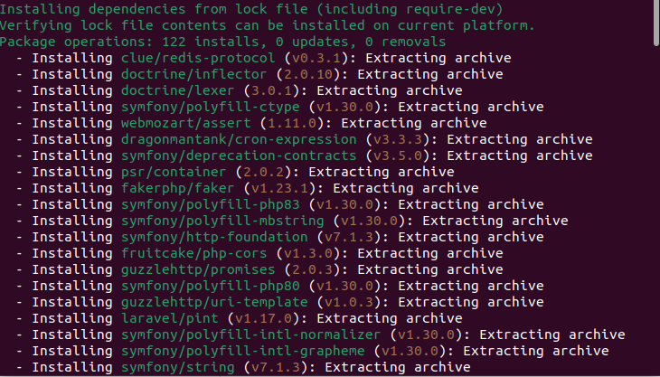
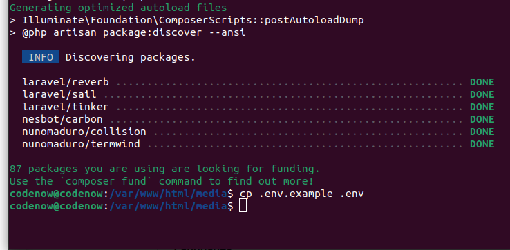
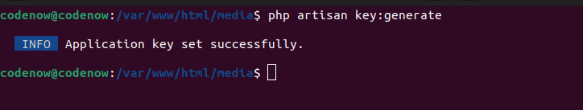
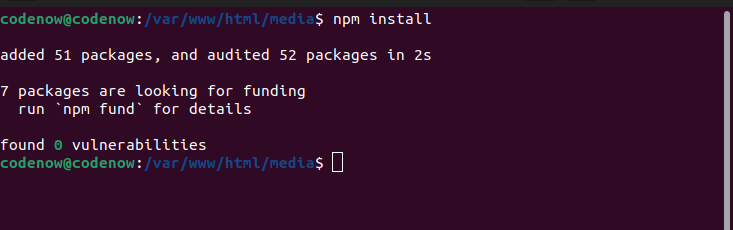
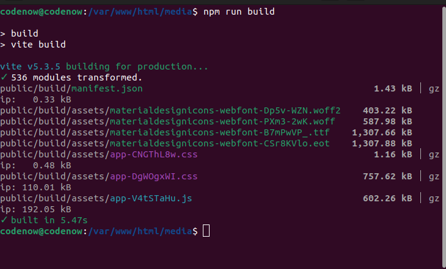
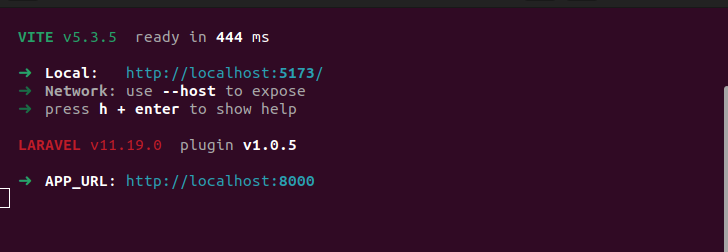
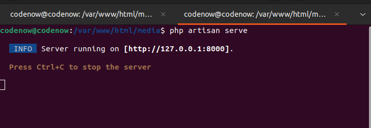
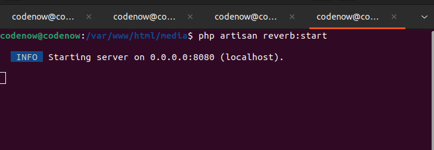
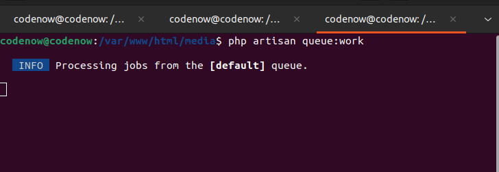

# Import Media App with Jobs & Websockets

This application allows users to import media files, process them through jobs, and receive real-time updates via websockets using Reberb.

## Project Setup

### 1. Clone this repo

### 2. Install Composer Dependencies:
```sh
composer install
```

### 3. Make a copy of environment file
Go to the app folder

```sh
cd /path/to/your/app/folder
```
Copy .env.example to .env:
```sh
cp .env.example .env
```

### 4. Run Database Migrations:
```sh
php artisan migrate 
```
During migration it will ask for create new database choose yes if db not exist


### 5. Generate Key:
```sh
php artisan key:generate 
```


### 6. Install NPM Dependencies:
```sh
npm install
```


## For Production

### Type-Check, Compile, and Minify:

To compile and minify the application for production, run:

```sh
npm run build
```


## For Development

### Compile and Hot-Reload

```sh
npm run dev
```


## Running the Application

### Real-Time Development

To start the project and see changes in real-time, follow these steps:

1. Open WAMP (or any other local development server).
2. Open a terminal and start the PHP server:

```sh
php artisan serve
```



3. In a separate terminal, run:

```sh
npm run dev
```


### Running Websockets & Queue

To start the websockets, follow these steps:

```sh
php artisan reverb:start
```


4. In another terminal, run:

```sh
php artisan queue:work
```



## Environment Configuration

Ensure your .env file is correctly configured for your local development environment. Key settings include:

- Database connection settings
- Websockets configuration
- Queue driver settings

## Accessing the Application

If everything is set up correctly, you can access your application at:

[http://localhost:8000](http://localhost:8000)

That's all.


